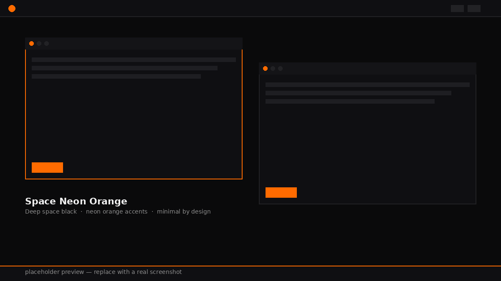

# Space Neon Orange — KDE Plasma Theme

An ultra-minimal, high-contrast dark theme for KDE Plasma designed for performance and aesthetic clarity. Deep space blacks (`#0A0A0B`), grayscale hierarchy, and vibrant neon orange (`#FF6B00`) accents.



## Features

- **Ultra-low resource overhead** — pure GTK and KDE color definitions, no heavy third-party engines.
- **Deep space palette** — pitch black base, dark grays for UI elements, white for text legibility.
- **Neon orange accents** — precise highlight colors for borders, buttons, and selections.
- **Orange-only interaction states** — hover, selected items, task-manager buttons, radio controls, and scrollbars no longer fall back to blue.
- **Monochrome icons** — Yet Another Monochrome Icon Set (YAMIS) follows the Plasma foreground colour, keeping iconography grayscale.
- **JetBrainsMono Nerd Font Mono** — applied comprehensively across Plasma (menu, toolbar, window titles, small fonts, fixed, general) and GTK.
- **High-contrast checkbutton readability** — checkbox labels remain crisp white (`#F0F0F0`) on hover/selection while accentuating the indicator box.
- **Custom System Tray SVGs** — minimalistic, high-precision Plasma system tray icons (`systemtray`, `audio`, `network`, `battery`, `notifications`, `bluetooth`).
- **Custom Antigravity IDE Icon** — sleek deep space dark & neon orange vector icon (`icons/antigravity.svg`).
- **Darker panel palette** — the panel and button surfaces sit below the window background for a more deliberate contrast.
- **Rofi launcher** — a small keyboard-first `drun` launcher with the same black, orange, and JetBrains Mono treatment.
- **Multi-version support** — works on KDE Plasma 5 and Plasma 6.
- **Matching Konsole theme** included for a consistent terminal look.

## One-Line Quick Install

```bash
bash -c "$(curl -fsSL https://raw.githubusercontent.com/heli-toon/space-neon-plasma/main/install.sh)"
```

> Replace `heli-toon` with your GitHub username once you've pushed the repo.

## Manual Installation

```bash
git clone https://github.com/heli-toon/space-neon-plasma.git
cd space-neon-plasma
chmod +x install.sh
./install.sh
```

## After Installing

1. Open **System Settings → Appearance → Colors** and select **Space Neon Orange**.
2. Restart GTK apps (Firefox, GIMP, etc.) to pick up the new `gtk.css`.
3. In Konsole, go to **Settings → Edit Current Profile → Appearance** and select **Space Neon Orange**.
4. Install **Yet Another Monochrome Icon Set (YAMIS)** from **System Settings → Icons → Get New…**, then re-run the deployer. It selects the actual icon-theme key: `YAMIS`.
5. Install **JetBrainsMono Nerd Font Mono** (for example from the Nerd Fonts package) before applying the theme.
6. The included 4K orange-nebula wallpaper is applied automatically when `plasma-apply-wallpaperimage` is available.
7. Install `rofi` through your distro package manager, then use `space-neon-launcher` (or bind it to `Meta+Space` in **System Settings → Shortcuts → Custom Shortcuts**) for the minimal application launcher.

## Included Components

| Component | Path |
|---|---|
| KDE color scheme | `color-schemes/SpaceNeonOrange.colors` |
| GTK 3/4 CSS overrides | `gtk/gtk-3.0/gtk.css`, `gtk/gtk-4.0/gtk.css` |
| Konsole theme | `konsole/SpaceNeonOrange.colorscheme` |
| Plasma desktop theme & tray icons | `plasma/desktoptheme/SpaceNeonMinimal/` |
| Antigravity application icon | `icons/antigravity.svg` |
| 4K matching wallpaper | `wallpapers/space-neon-orange-nebula.jpg` |
| Rofi launcher | `rofi/config.rasi`, `rofi/space-neon-launcher` |

## Repository Structure

```text
space-neon-plasma/
├── install.sh
├── README.md
├── color-schemes/
│   └── SpaceNeonOrange.colors
├── gtk/
│   ├── gtk-3.0/gtk.css
│   └── gtk-4.0/gtk.css
├── plasma/
│   └── desktoptheme/SpaceNeonMinimal/metadata.desktop
└── konsole/
    └── SpaceNeonOrange.colorscheme
```

## Publishing to GitHub

```bash
git init
git add .
git commit -m "Initial commit: Space Neon Orange KDE theme"
git branch -M main
git remote add origin https://github.com/heli-toon/space-neon-plasma.git
git push -u origin main
```

Don't forget to drop a `preview.png` screenshot of your desktop into the repo root before pushing — the README links to it.

## License

MIT
